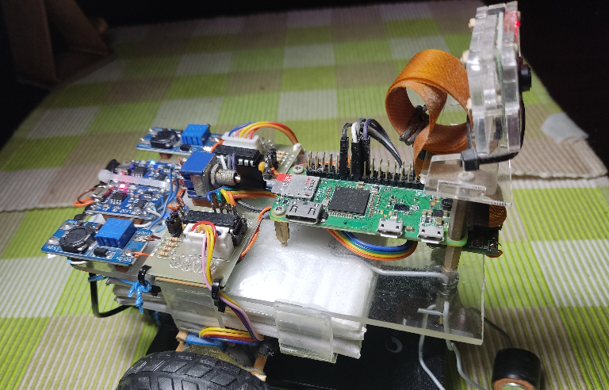

# Heinrich Hochkofler
Interest in Cloud-AWS, Kubernetes, Docker, Ansible, Terraform, Robotic for SysOps/DevOps

## INDEX

1. Author Heinrich Hochkofler
   1.  [curriculum vitae](./curriculum)

##

2. Robotic control: Wall-e construction in Raspberry Pi W
   1. [Wall-e docs-prices](./Wall-e_Docs)
   2. [Python StepMotors programs](./software-python)
   3. [Linux Shell routines](./software-shell)
   4. [hardware](./hardware)

##

##

3. Kubernetes

##

4. Docker

##

5. Ansible

##

6. Terraform

##

7. Python/Shell

##

   